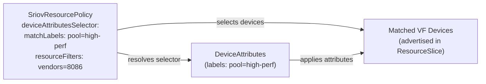
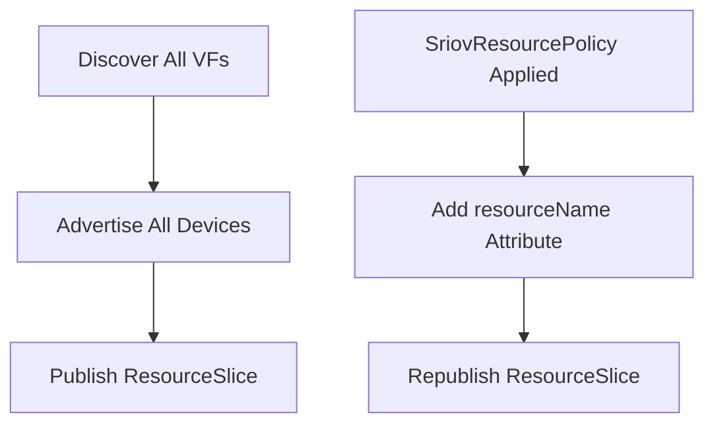
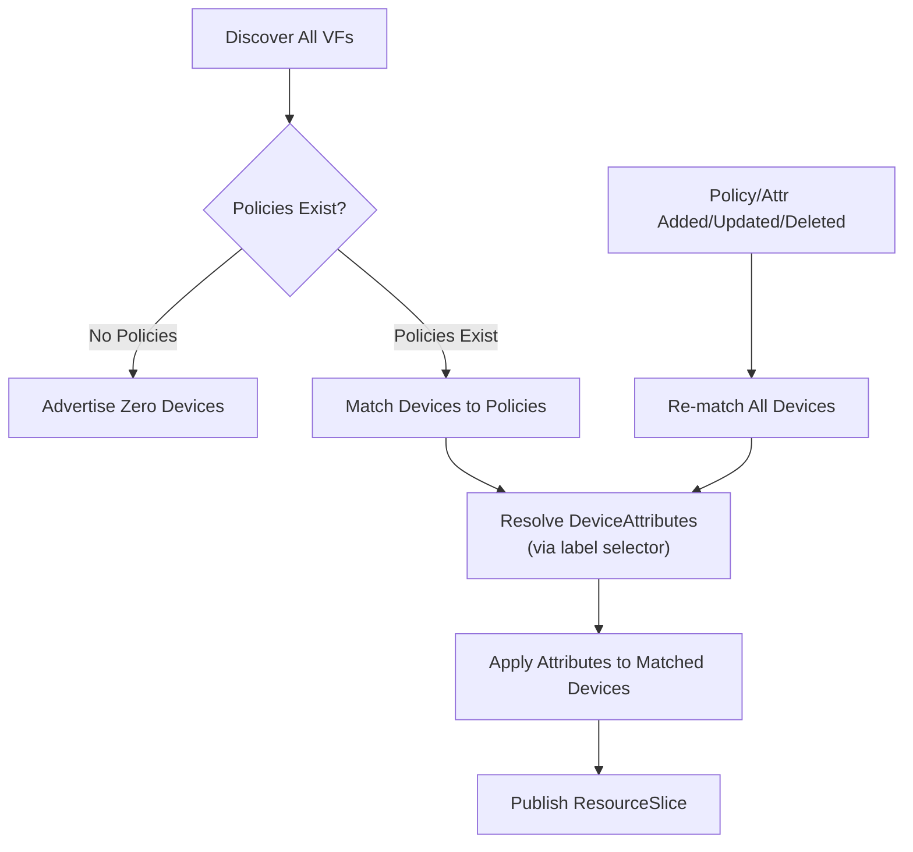
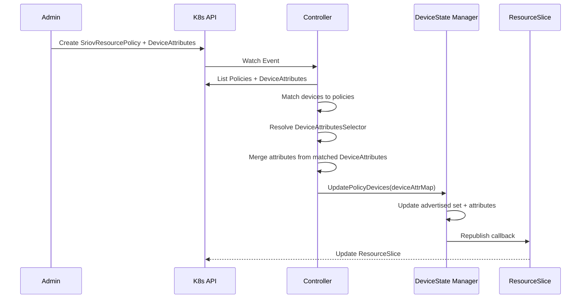

# Design: Opt-In Device Advertisement via SriovResourcePolicy and DeviceAttributes

**Status:** Proposed  
**Date:** 2026-02-16 (updated 2026-03-16)  
**Authors:** rollandf

## Overview

This design proposes changing the SR-IOV DRA driver from advertising all discovered devices by default to an explicit opt-in model where devices are only advertised when matching a `SriovResourcePolicy` Custom Resource. A separate `DeviceAttributes` CRD allows attaching arbitrary key/value attributes to matched devices, decoupling device selection from attribute assignment.

## Motivation

### Current Behavior

Today, the DRA driver:
1. Discovers all SR-IOV Virtual Functions (VFs) on node startup
2. Advertises **all** discovered VFs via ResourceSlice immediately
3. Uses `SriovResourcePolicy` CR to tag devices with `resourceName` attributes
4. Filtering is metadata-only; all devices remain advertised

### Problems with Current Approach

1. **Security Risk:** All SR-IOV devices are exposed by default, even if not intended for cluster use
2. **Resource Pollution:** ResourceSlices contain devices that may never be allocated
3. **No Intentional Control:** No way to explicitly hide devices from Kubernetes
4. **Naming Confusion:** "Filter" implies exclusion, but it only adds metadata
5. **Tight Coupling:** `resourceName` is hardcoded in the policy CRD, mirroring the old device-plugin API; adding new attributes requires schema changes
6. **Incompatible with SR-IOV Network Operator Integration:** Cannot serve as a drop-in replacement for sriov-device-plugin

### Strategic Rationale: SR-IOV Network Operator Integration

A primary driver for this architectural change is enabling `dra-driver-sriov` to function as a **replacement for sriov-device-plugin** within the SR-IOV Network Operator ecosystem.

**Current sriov-device-plugin behavior:**
- Does **not** advertise devices by default
- Requires explicit `SriovNetworkNodePolicy` CRs to configure which devices to expose
- Provides fine-grained control over device pools and resource names

By adopting an opt-in model with `SriovResourcePolicy`, `dra-driver-sriov` mirrors the operational model of `sriov-device-plugin`, making it a viable DRA-based successor that integrates seamlessly with SR-IOV Network Operator's existing policy-driven approach.

### Proposed Behavior

With this design:
1. Driver discovers all VFs but **does not advertise** them by default
2. Devices are **only advertised** when they match a `SriovResourcePolicy` config's resource filters
3. No matching policy = zero devices advertised (explicit opt-in)
4. Optional `DeviceAttributes` CRD provides arbitrary attributes (including `resourceName`) to matched devices
5. Dynamic updates when policies, device attributes, or node labels change

## Goals

- Change to explicit opt-in model for device advertisement
- Use `SriovResourcePolicy` CRD for device selection (renamed from `SriovResourceFilter`)
- Introduce `DeviceAttributes` CRD to decouple attribute assignment from device selection
- Support dynamic ResourceSlice updates when policies, attributes, or hardware changes
- Maintain clean architecture with minimal disruption

## Non-Goals

- Backward compatibility with old CR names (clean break)
- Automatic migration of existing CRs (manual migration with tooling/docs)
- Changes to device preparation or allocation logic
- Changes to CDI, CNI, or NRI integration

## Design Details

### 1. Two-CRD Architecture



- **`SriovResourcePolicy`** selects which devices to advertise based on node + NIC selectors. Optionally references `DeviceAttributes` via a label selector.
- **`DeviceAttributes`** defines arbitrary key/value attributes applied to devices matched by policies. Linked to policies via labels.

A device matched by a policy is advertised **regardless** of whether any `DeviceAttributes` are attached. Attributes are purely additive metadata.

### 2. API Types

#### SriovResourcePolicy

```yaml
apiVersion: sriovnetwork.k8snetworkplumbingwg.io/v1alpha1
kind: SriovResourcePolicy
metadata:
  name: intel-high-perf-nics
  namespace: dra-driver-sriov
spec:
  nodeSelector:
    nodeSelectorTerms:
    - matchExpressions:
      - key: kubernetes.io/hostname
        operator: In
        values:
        - worker-node-1
  configs:
  - deviceAttributesSelector:
      matchLabels:
        pool: intel-high-perf
    resourceFilters:
    - vendors: ["8086"]
      devices: ["159b"]
      pfNames: ["eth0"]
```

#### DeviceAttributes

```yaml
apiVersion: sriovnetwork.k8snetworkplumbingwg.io/v1alpha1
kind: DeviceAttributes
metadata:
  name: intel-high-perf-attrs
  namespace: dra-driver-sriov
  labels:
    pool: intel-high-perf
spec:
  attributes:
    sriovnetwork.k8snetworkplumbingwg.io/resourceName:
      string: "intel-high-perf"
```

#### Go Type Definitions

**File:** `pkg/api/sriovdra/v1alpha1/api.go`

```go
type SriovResourcePolicy struct {
    metav1.TypeMeta   `json:",inline"`
    metav1.ObjectMeta `json:"metadata,omitempty"`
    Spec              SriovResourcePolicySpec `json:"spec"`
}

type SriovResourcePolicySpec struct {
    NodeSelector *corev1.NodeSelector `json:"nodeSelector,omitempty"`
    Configs      []Config          `json:"configs,omitempty"`
}

type Config struct {
    DeviceAttributesSelector *metav1.LabelSelector `json:"deviceAttributesSelector,omitempty"`
    ResourceFilters          []ResourceFilter       `json:"resourceFilters,omitempty"`
}

type DeviceAttributes struct {
    metav1.TypeMeta   `json:",inline"`
    metav1.ObjectMeta `json:"metadata,omitempty"`
    Spec              DeviceAttributesSpec `json:"spec"`
}

type DeviceAttributesSpec struct {
    Attributes map[resourceapi.QualifiedName]resourceapi.DeviceAttribute `json:"attributes,omitempty"`
}
```

### 3. Behavioral Changes: Opt-In Model

#### Current Flow



#### Proposed Flow



#### Key Changes

1. **Initial State:** Empty ResourceSlice (zero devices) until a policy is applied
2. **Device Matching:** Only devices matching at least one policy config's filters are advertised
3. **Empty Filters:** A config with no `resourceFilters` matches all devices on the node
4. **Attributes are Optional:** A config without `deviceAttributesSelector` still advertises matched devices (with discovery attributes only)
5. **Policy Lifecycle:**
   - **Create/Update:** Re-evaluate all devices, resolve attributes, update ResourceSlice
   - **Delete:** Remove devices that only matched deleted policy
6. **No Policy:** If all policies are deleted or none match the node, advertise zero devices

### 4. Controller Logic

#### Reconciliation Sequence



#### Watched Resources

The controller watches:
- `SriovResourcePolicy` (create/update/delete)
- `DeviceAttributes` (create/update/delete)
- `Node` (label changes)

All watches use namespace-scoped predicates and trigger a full reconciliation.

#### Key Method Signatures

**Controller** (`pkg/controller/resourcepolicycontroller.go`):

```go
func (r *SriovResourcePolicyReconciler) Reconcile(ctx context.Context, req ctrl.Request) (ctrl.Result, error)

func (r *SriovResourcePolicyReconciler) getPolicyDeviceMap(
    policies []*sriovdrav1alpha1.SriovResourcePolicy,
    allDeviceAttrs []sriovdrav1alpha1.DeviceAttributes,
) map[string]map[resourceapi.QualifiedName]resourceapi.DeviceAttribute

func (r *SriovResourcePolicyReconciler) resolveDeviceAttributes(
    selector *metav1.LabelSelector,
    allDeviceAttrs []sriovdrav1alpha1.DeviceAttributes,
) map[resourceapi.QualifiedName]resourceapi.DeviceAttribute
```

### 5. Device State Manager

**Interface** (`pkg/devicestate/interface.go`):

```go
type DeviceState interface {
    GetAllocatableDevices() drasriovtypes.AllocatableDevices
    GetAdvertisedDevices() drasriovtypes.AllocatableDevices
    UpdatePolicyDevices(ctx context.Context, policyDevices map[string]map[resourceapi.QualifiedName]resourceapi.DeviceAttribute) error
}
```

- `GetAdvertisedDevices()` returns only devices matched by a policy (used by `PublishResources()`)
- `UpdatePolicyDevices()` updates the advertised set and applies/clears policy attributes. Keys = devices to advertise, values = attributes to apply. Tracks policy-managed vs. discovery attributes to avoid clearing vendor, deviceID, etc.

### 6. ResourceSlice Publishing

`PublishResources()` publishes only `GetAdvertisedDevices()` to the ResourceSlice:

```go
func (d *Driver) PublishResources(ctx context.Context) error {
    advertised := d.deviceStateManager.GetAdvertisedDevices()
    // ... publish only advertised devices to ResourceSlice
}
```

### 7. Edge Cases and Error Handling

#### No Policies Match Node

Advertise zero devices. `UpdatePolicyDevices(empty map)` clears all policy attributes and empties the advertised set.

#### Policy Deleted While Devices Allocated

Already-allocated devices remain bound to pods (DRA ResourceClaims are immutable once allocated). The devices are removed from the ResourceSlice, preventing new allocations.

#### Multiple Policies Match Same Device

First matching policy's config wins (device is skipped once already in the map). Document this behavior.

#### Multiple DeviceAttributes Match a Selector

Attributes are merged. When the same key appears in multiple objects, the value from the alphabetically last object name wins (deterministic).

## Migration Guide

### Migration Steps

1. **Backup Existing Resources**
   ```bash
   kubectl get sriovresourcefilters -n dra-driver-sriov -o yaml > backup.yaml
   ```

2. **Update CRDs**
   ```bash
   kubectl delete crd sriovresourcefilters.sriovnetwork.k8snetworkplumbingwg.io
   # Apply new CRDs (included in Helm chart)
   ```

3. **Convert Manifests**
   For each old policy with `resourceName`, create:
   - A `DeviceAttributes` object with the `resourceName` attribute and a label
   - A `SriovResourcePolicy` with `deviceAttributesSelector` pointing to that label

4. **Upgrade Driver**
   ```bash
   helm upgrade dra-driver-sriov ./deployments/helm/dra-driver-sriov \
     --namespace dra-driver-sriov
   ```

### Breaking Changes

- **CRD Rename:** `SriovResourceFilter` has been renamed to `SriovResourcePolicy`
- **Field Removed:** `Config.ResourceName` → replaced by `Config.DeviceAttributesSelector` + `DeviceAttributes` CRD
- **Default Behavior:** All devices advertised → Zero devices advertised
- **No Automatic Migration**

## Testing Strategy

### Unit Tests

1. **Controller Tests** (`pkg/controller/resourcepolicycontroller_test.go`)
   - Policy matching logic
   - Device filtering with various criteria
   - DeviceAttributes selector resolution and attribute merging
   - Empty policy list handling
   - Multiple policies / multiple DeviceAttributes

2. **Device State Manager Tests** (`pkg/devicestate/state_test.go`)
   - `GetAdvertisedDevices()` returns only policy-matched devices
   - `UpdatePolicyDevices()` sets/clears policy attributes without touching discovery attributes
   - Republish callback triggered on changes

3. **Driver Tests** (`pkg/driver/driver_test.go`)
   - `PublishResources()` uses `GetAdvertisedDevices()`

### Integration Tests

1. Start driver with no policies → verify zero devices advertised
2. Create policy → verify matching devices advertised
3. Create DeviceAttributes + policy with selector → verify attributes applied
4. Delete policy → verify devices removed
5. Update DeviceAttributes → verify attribute changes propagate

## Implementation Plan

### 1. API Changes
- [x] Add `DeviceAttributes` type (uses `resourceapi.QualifiedName` / `resourceapi.DeviceAttribute` directly)
- [x] Replace `Config.ResourceName` with `Config.DeviceAttributesSelector`
- [x] Regenerate deep copy and CRD YAMLs
- [x] Update RBAC for `deviceattributes` resource

### 2. Controller Updates
- [x] Watch `DeviceAttributes` in addition to `SriovResourcePolicy` and `Node`
- [x] Resolve `DeviceAttributesSelector` via label matching
- [x] Build `map[deviceName]map[QualifiedName]DeviceAttribute` and call `UpdatePolicyDevices()`

### 3. Device State Manager Updates
- [x] Add `GetAdvertisedDevices()` method
- [x] Add `UpdatePolicyDevices()` method with policy/discovery attribute tracking
- [x] Remove `UpdateDeviceResourceNames()`

### 4. Driver Updates
- [x] Update `PublishResources()` to use `GetAdvertisedDevices()`

### 5. Testing & Documentation
- [x] Update unit tests for new API and methods
- [x] Update demo examples
- [x] Update design document

## Security Considerations

### Improvements

1. **Reduced Attack Surface:** Devices not explicitly allowed are not exposed
2. **Principle of Least Privilege:** Administrators must explicitly grant access
3. **Namespace Isolation:** Policies and DeviceAttributes are namespace-scoped

### Recommendations

1. Add validating webhook to reject invalid policies / DeviceAttributes
2. Add policy status field showing matched devices (for debugging)
3. Add audit logging for policy changes

## Open Questions

1. **Webhook Validation:** Should we add a validating webhook to enforce constraints?
2. **Policy Priority:** Should we support priority fields for overlapping policies?
3. **Status Field:** Should policies have a status showing matched devices?

## References

- [Kubernetes Dynamic Resource Allocation (DRA)](https://kubernetes.io/docs/concepts/scheduling-eviction/dynamic-resource-allocation/)
- [SR-IOV Device Plugin](https://github.com/k8snetworkplumbingwg/sriov-network-device-plugin)
- [Container Device Interface (CDI)](https://github.com/cncf-tags/container-device-interface)
- Current implementation: `pkg/controller/resourcepolicycontroller.go`
- Current discovery: `pkg/devicestate/discovery.go`
- Current driver: `pkg/driver/driver.go`
